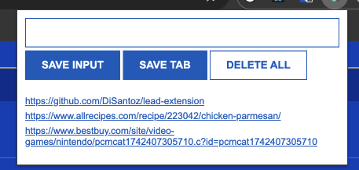

# [Lead Extension]

A Google Chrome Exentension useful for saving links through user input or saving the current tab you are viewing. No need to have endless bookmarks, now you can save links with ease.



## 🧩 Installation

1. Download or clone this repository:
   ```bash
   git clone https://github.com/DiSantoz/lead-extension.git
   ```
2. Open Chrome and go to chrome://extensions/

3. Enable Developer mode (top-right corner)

4. Click Load unpacked

5. Select the folder containing this extension's code

## Development

1. Feel free to edit the colors, layout and functionality of buttons on the respective files

2. Once you are happy with your changes, reload the extension from chrome://extensions.

## MIT License

Copyright (c) 2025 DiSantoz

Permission is hereby granted, free of charge, to any person obtaining a copy
of this software and associated documentation files (the "Software"), to deal
in the Software without restriction, including without limitation the rights
to use, copy, modify, merge, publish, distribute, sublicense, and/or sell
copies of the Software, and to permit persons to whom the Software is
furnished to do so, subject to the following conditions:

The above copyright notice and this permission notice shall be included in all
copies or substantial portions of the Software.

THE SOFTWARE IS PROVIDED "AS IS", WITHOUT WARRANTY OF ANY KIND, EXPRESS OR
IMPLIED, INCLUDING BUT NOT LIMITED TO THE WARRANTIES OF MERCHANTABILITY,
FITNESS FOR A PARTICULAR PURPOSE AND NONINFRINGEMENT. IN NO EVENT SHALL THE
AUTHORS OR COPYRIGHT HOLDERS BE LIABLE FOR ANY CLAIM, DAMAGES OR OTHER
LIABILITY, WHETHER IN AN ACTION OF CONTRACT, TORT OR OTHERWISE, ARISING FROM,
OUT OF OR IN CONNECTION WITH THE SOFTWARE OR THE USE OR OTHER DEALINGS IN THE
SOFTWARE.
